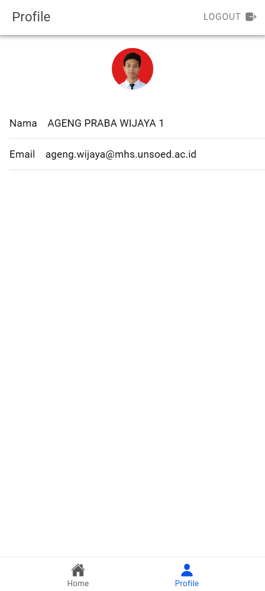

# Vue Firebase

Tugas 9 pertemuan 10 praktikum pemrograman mobile membuat fitur authentication Firebase.

## Penjelasan Proses Authentication

### 1. Sign In With Google

 
 

#### Setup Autentikasi Google di Firebase

- Firebase Authentication sudah diatur untuk mendukung metode Google Sign-In.
- Client ID Google disiapkan di `GoogleAuth.initialize()` untuk menghubungkan aplikasi dengan akun Google pengguna.

#### Login Menggunakan Google (Halaman Login)

- Aplikasi memulai login Google dengan `GoogleAuth.signIn()`.
- Mengambil ID Token `googleUser.authentication.idToken` dari Google.
- ID Token diproses menjadi credential Firebase menggunakan `GoogleAuthProvider.credential()`.
- `signInWithCredential(auth, credential)` mengautentikasi pengguna dan menyimpan data ke variabel user (misalnya, nama, email, foto profil).
- Setelah berhasil login, pengguna diarahkan ke halaman `home`.

### 2. Halaman Profile

    

Data pengguna (`displayName`, `email`, `photoURL`) ditampilkan di halaman profil (`ProfilPage.vue`):

- Foto Profil: Ditampilkan menggunakan URL dari `user?.photoURL`. Jika gagal dimuat, gambar default digunakan.
- Nama: Ditampilkan dari `user?.displayName`.
- Email: Ditampilkan dari `user?.email`.
